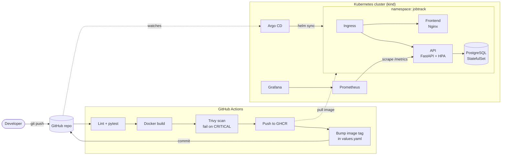

# JobTrack – GitOps CI/CD on Kubernetes

[](https://github.com/ahmed-elgamil-devops/jobtrack-gitops/actions/workflows/ci.yml)

A small job-application tracker (FastAPI + Nginx + PostgreSQL) delivered through a **complete DevOps pipeline**:
every commit is tested, built into a container, **security-scanned with Trivy**, pushed to GHCR, and deployed
to Kubernetes automatically by **Argo CD (GitOps)**, with **Prometheus/Grafana** monitoring and alerting.

> I built it because I was applying to a lot of jobs and needed to track them, and it gave me a real app to practise
> the full path from commit to production.

---

## Architecture



## What this project demonstrates

| Area | Implementation |
|------|----------------|
| **Containers** | Multi-stage Dockerfile, non-root users, slim/alpine bases, healthchecks |
| **CI** | GitHub Actions: Ruff lint, pytest, Helm lint, matrix build for 2 services, build cache |
| **DevSecOps** | Trivy image scan blocks the pipeline on CRITICAL CVEs; SARIF report in the GitHub Security tab |
| **Registry** | GitHub Container Registry (GHCR), images tagged with the commit SHA |
| **GitOps / CD** | Argo CD with auto-sync, self-heal and prune; CI bumps the image tag in Git and Argo CD deploys it |
| **Kubernetes** | Helm chart: Deployments, StatefulSet + PVC, Services, Ingress, Secrets, HPA, rolling updates with zero downtime |
| **Reliability** | Liveness/readiness probes (readiness checks the DB), resource requests/limits, `maxUnavailable: 0` |
| **Security** | `runAsNonRoot`, read-only root filesystem, dropped Linux capabilities, seccomp, no secrets in Git |
| **Observability** | Prometheus metrics (HTTP + business metrics), ServiceMonitor, Grafana dashboard as code, PrometheusRule alerts |
| **Environments** | `values.yaml` (prod-like, HPA) and `values-dev.yaml` (single replica, debug logs) |

## Tech stack

`Python` `FastAPI` `PostgreSQL` `Nginx` `Docker` `GitHub Actions` `Trivy` `GHCR` `Kubernetes` `kind` `Helm` `Argo CD` `Prometheus` `Grafana`

---

## Repository structure

```
.
├── api/                    # FastAPI service + tests + Dockerfile
├── frontend/               # Static UI served by unprivileged Nginx
├── helm/jobtrack/          # Helm chart (api, frontend, postgres, ingress, HPA, monitoring)
│   └── dashboards/         # Grafana dashboard JSON (shipped as a ConfigMap)
├── argocd/application.yaml # Argo CD Application (GitOps)
├── monitoring/             # kube-prometheus-stack values for kind
├── scripts/                # kind cluster setup + load test
├── .github/workflows/ci.yml
└── docker-compose.yml      # Local development
```

## Run it

### Option 1 – Docker Compose (fastest)

```bash
docker compose up --build
# App: http://localhost:8080    API docs: http://localhost:8000/docs    Metrics: http://localhost:8000/metrics
```

### Option 2 – Full GitOps setup on a local Kubernetes cluster

**Requirements:** Docker, [kind](https://kind.sigs.k8s.io/), kubectl, Helm.

1. **Fork / push this repo** to GitHub and let the CI run once on `main`. It builds the images and pushes them to GHCR.
2. **Make the two packages public** (GitHub → your profile → Packages → `jobtrack-api` / `jobtrack-frontend` → Package settings → Change visibility), so the cluster can pull them without credentials.
3. If you forked it under another account, update `repoURL` in `argocd/application.yaml` and the image repositories in `helm/jobtrack/values.yaml`.
4. Create the cluster and install everything:

   ```bash
   ./scripts/setup-kind.sh
   ```

   This creates a kind cluster, then installs ingress-nginx, metrics-server, kube-prometheus-stack and Argo CD, then deploys the app through Argo CD.
5. Add `127.0.0.1 jobtrack.local` to your hosts file and open **http://jobtrack.local**.

### See GitOps in action

```bash
# change something in the API, e.g. the version string or a new endpoint
git commit -am "feat: my change" && git push
```

Watch the pipeline in the **Actions** tab. When it finishes, it commits `ci: deploy <sha>`, and within about 3 minutes Argo CD
rolls out the new pods (`kubectl -n jobtrack get pods -w`). The version shown in the app footer updates.

### Load test and autoscaling

```bash
./scripts/load-test.sh http://jobtrack.local 180
kubectl -n jobtrack get hpa -w        # (HPA is enabled in values.yaml / prod profile)
```

---

## CI/CD pipeline

| Job | What it does |
|-----|--------------|
| `test` | Installs dependencies, runs **Ruff** and **pytest** (8 tests incl. metrics endpoint) |
| `helm-lint` | `helm lint` + `helm template` to catch chart errors before deploy |
| `build-scan-push` | Matrix over `api` / `frontend`: build, **Trivy** scan (fails on CRITICAL), upload SARIF, push `:<sha>` and `:latest` to GHCR |
| `update-manifests` | Uses `yq` to write the new tag into `helm/jobtrack/values.yaml` and commits it with `[skip ci]`, so Argo CD deploys it |

Pull requests run tests, lint and scanning but **never push or deploy**.

## Monitoring

The API exposes `/metrics` with:

- `http_requests_total`, `http_request_duration_seconds` (by handler, method, status)
- `jobtrack_jobs_created_total{source}`, `jobtrack_status_changes_total{status}`, `jobtrack_jobs_by_status{status}`

The Grafana dashboard **"JobTrack"** (loaded automatically) shows requests per second, error rate, p50/p95/p99 latency,
pods up, and applications by status and source.

Alerts (`PrometheusRule`): **API down**, **error rate > 5%**, **p95 latency > 500 ms**.

## API

| Method | Path | Description |
|--------|------|-------------|
| GET | `/api/jobs?status_filter=Interview` | List applications (optional filter) |
| POST | `/api/jobs` | Add an application |
| PATCH | `/api/jobs/{id}` | Change status (`Applied`, `Interview`, `Offer`, `Rejected`) |
| DELETE | `/api/jobs/{id}` | Delete |
| GET | `/api/stats` | Totals, response rate, interview rate |
| GET | `/healthz`, `/readyz` | Liveness / readiness (readiness checks the DB) |

Interactive docs: `/docs` (Swagger UI).

## Next steps

- [ ] Terraform module to run the same setup on AWS EKS
- [ ] Sealed Secrets / External Secrets instead of a manually created DB secret
- [ ] Separate staging and production Argo CD apps with promotion by pull request
- [ ] Alertmanager notifications to Slack

---

**Author:** Ahmed Elgamil, Junior DevOps & Cloud Engineer, Dubai · [LinkedIn](https://linkedin.com/in/ahmed-elgamil-devops) · [GitHub](https://github.com/ahmed-elgamil-devops)
